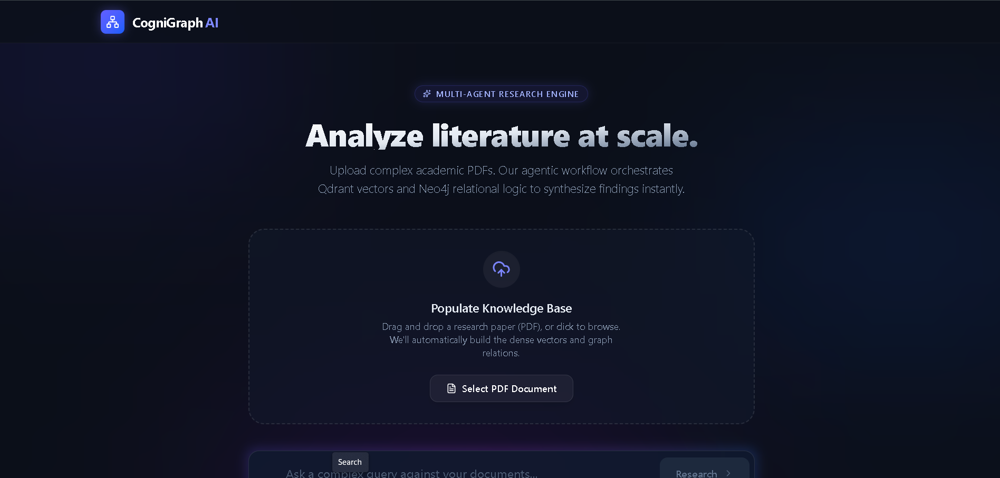

# 🧠 CogniGraph AI

<div align="center">

### An Enterprise-Grade Agentic RAG Architecture

**Synthesize complex academic papers instantly using parallel Vector & Graph Database retrieval, orchestrated by stateful AI Agents.**


</div>

---

## 🚀 Overview

**CogniGraph AI** is a production-ready implementation of **Agentic Retrieval-Augmented Generation (RAG)** designed for academic research and complex document synthesis.



Unlike traditional RAG systems that rely solely on vector similarity search, CogniGraph intelligently combines:

- 🔍 **Semantic Retrieval** using **Qdrant Vector Database**
- 🕸️ **Knowledge Graph Traversal** using **Neo4j**
- 🧠 **LLM-Powered Query Routing**
- ⚡ **Parallel Fan-Out/Fan-In Retrieval**
- 🔄 **Stateful Agent Orchestration with LangGraph**

This enables highly accurate responses while significantly reducing hallucinations during reasoning-heavy tasks.

---

# ✨ Core Features

## 🧠 Agentic Query Routing

Uses **Llama 3.3 70B (Groq)** to analyze user intent and dynamically route queries to:

- Vector Search
- Graph Search
- Hybrid Search (Both simultaneously)

---

## 🕸️ Hybrid Retrieval Architecture

Combines:

### Vector Database (Qdrant)

- Dense Embeddings
- Semantic Similarity Search
- Concept Discovery

### Graph Database (Neo4j)

- Entity Relationships
- Knowledge Traversal
- Structured Reasoning

This dual retrieval pipeline provides richer context than traditional RAG systems.

---

## 📄 Parent-Child Chunking

Advanced PDF ingestion pipeline that:

- Preserves document hierarchy
- Maintains contextual relationships
- Improves retrieval quality
- Enhances long-document understanding

---

## 🛡️ Strict Type Validation

Built with **Pydantic** to enforce:

- Structured Outputs
- Type Safety
- Reliable API Contracts
- Frontend Consistency

---

## ⚡ Fully Asynchronous Backend

- Async FastAPI Endpoints
- Non-blocking Database Operations
- Concurrent Retrieval Execution
- High Throughput Architecture

---

## 💎 Premium User Experience

Inspired by modern SaaS platforms like:

- Vercel
- Linear
- Raycast

Features:

- Glassmorphism UI
- Dark Mode
- Interactive Uploads
- Real-Time Metrics
- Mobile Responsive Layout

---

# 🏗️ System Architecture

```text
                     ┌──────────────────┐
                     │   User Query     │
                     └────────┬─────────┘
                              │
                              ▼
                 ┌─────────────────────────┐
                 │  Llama 3.3 Router Agent │
                 └───────────┬─────────────┘
                             │
              ┌──────────────┼──────────────┐
              │                              │
              ▼                              ▼
   ┌──────────────────┐          ┌──────────────────┐
   │  Qdrant Vector   │          │   Neo4j Graph    │
   │    Retrieval     │          │    Retrieval     │
   └────────┬─────────┘          └────────┬─────────┘
            │                             │
            └─────────────┬───────────────┘
                          ▼
             ┌────────────────────────┐
             │  LangGraph Orchestrator│
             └───────────┬────────────┘
                         ▼
             ┌────────────────────────┐
             │   Response Generator   │
             └───────────┬────────────┘
                         ▼
                  Final Answer
```

---

# 🛠️ Tech Stack

## Backend

| Technology | Purpose |
|------------|----------|
| FastAPI | API Framework |
| LangChain | LLM Workflows |
| LangGraph | Agent Orchestration |
| Groq | LLM Inference |
| FastEmbed | Local Embeddings |
| Qdrant | Vector Database |
| Neo4j | Knowledge Graph |
| Pydantic | Data Validation |

---

## Frontend

| Technology | Purpose |
|------------|----------|
| React | UI Framework |
| Vite | Build Tool |
| Tailwind CSS | Styling |
| Lucide Icons | Icons |
| Axios | API Requests |

---

# 📦 Installation

## 1️⃣ Clone Repository

```bash
git clone https://github.com/yourusername/cognigraph-ai.git

cd cognigraph-ai
```

---

## 2️⃣ Create Virtual Environment

### Linux / macOS

```bash
python -m venv .venv

source .venv/bin/activate
```

### Windows

```bash
python -m venv .venv

.venv\Scripts\activate
```

---

## 3️⃣ Install Dependencies

```bash
pip install -r requirements.txt
```

---

# 🔐 Environment Variables

Create a `.env` file in the root directory:

```env
# =====================================
# AI MODELS
# =====================================

GROQ_API_KEY=gsk_your_groq_api_key

# =====================================
# NEO4J DATABASE
# =====================================

NEO4J_URI=neo4j+s://your-db-id.databases.neo4j.io

NEO4J_USERNAME=neo4j

NEO4J_PASSWORD=your_secure_password

# =====================================
# QDRANT 
# =====================================

QDRANT_URL= your_qdrant_url

QDRANT_API_KEY= your_qdrant_api_key
```

---

# 📚 Populate Databases

To fully test the hybrid retrieval architecture, add sample data.

Place an academic PDF in the project root:

```text
sample_paper.pdf
```

---

## Upload Vectors to Qdrant

```bash
python -m core.populate
```

---

## Populate Neo4j Knowledge Graph

```bash
python -m core.populate_graph
```

---

# 🏃 Running the Application

The frontend and backend must run simultaneously.

---

## Terminal 1 — Backend

```bash
uvicorn main:app --host 0.0.0.0 --port 8000
```

### API Documentation

```text
http://localhost:8000/docs
```

---

## Terminal 2 — Frontend

```bash
cd frontend

npm install

npm run dev
```

### Frontend URL

```text
http://localhost:5173
```

---

# 📁 Project Structure

```text
cognigraph-ai/
│
├── api/
│   └── routes.py
│
├── core/
│   ├── agents.py
│   ├── graph.py
│   ├── ingestion.py
│   ├── retrieval.py
│   ├── populate.py
│   └── populate_graph.py
│
├── database/
│   └── connections.py
│
├── frontend/
│   ├── src/
│   │   └── App.jsx
│   │
│   └── tailwind.config.js
│
├── main.py
├── requirements.txt
├── .env
└── README.md
```

---

# 🌐 Deployment

CogniGraph AI is designed using a decoupled cloud-native architecture.

## Database Layer

### Qdrant Cloud

Stores:

- Embeddings
- Vector Indexes
- Semantic Search Data

### Neo4j AuraDB

Stores:

- Entities
- Relationships
- Knowledge Graphs

---

## Backend Deployment

Recommended:

- Render
- Railway
- Fly.io
- AWS ECS

---

## Frontend Deployment

Recommended:

- Vercel
- Netlify

---

# 🎯 Use Cases

### Academic Research Assistant

Summarize and analyze:

- Research Papers
- Journals
- Technical Reports

---

### Enterprise Knowledge Search

Search across:

- Internal Documentation
- SOPs
- Knowledge Bases

---

### Scientific Discovery

Connect hidden relationships between:

- Concepts
- Authors
- Technologies
- Research Domains

---

# 🔮 Future Roadmap

- [ ] Multi-PDF Knowledge Fusion
- [ ] GraphRAG Enhancements
- [ ] Citation-Aware Responses
- [ ] Source Highlighting
- [ ] Multi-Agent Debate System
- [ ] Research Paper Recommendation Engine
- [ ] Streaming Responses
- [ ] Authentication & User Workspaces

---

# 🤝 Contributing

Contributions are welcome!

```bash
Fork the repository

Create a feature branch

Commit changes

Open a Pull Request
```

---

# 📜 License

This project is licensed under the MIT License.

---

<div align="center">

### ⭐ If you found this project useful, consider giving it a star!

**Built with FastAPI • LangGraph • Qdrant • Neo4j • Groq • React**

</div>